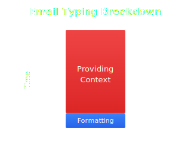
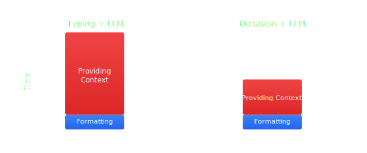
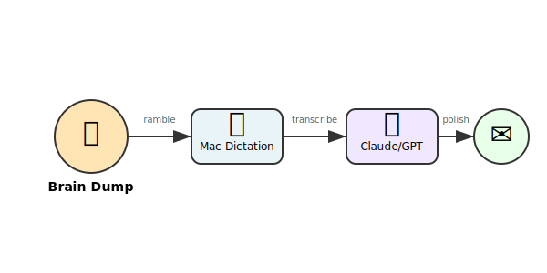
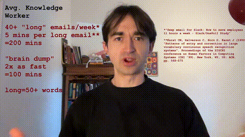
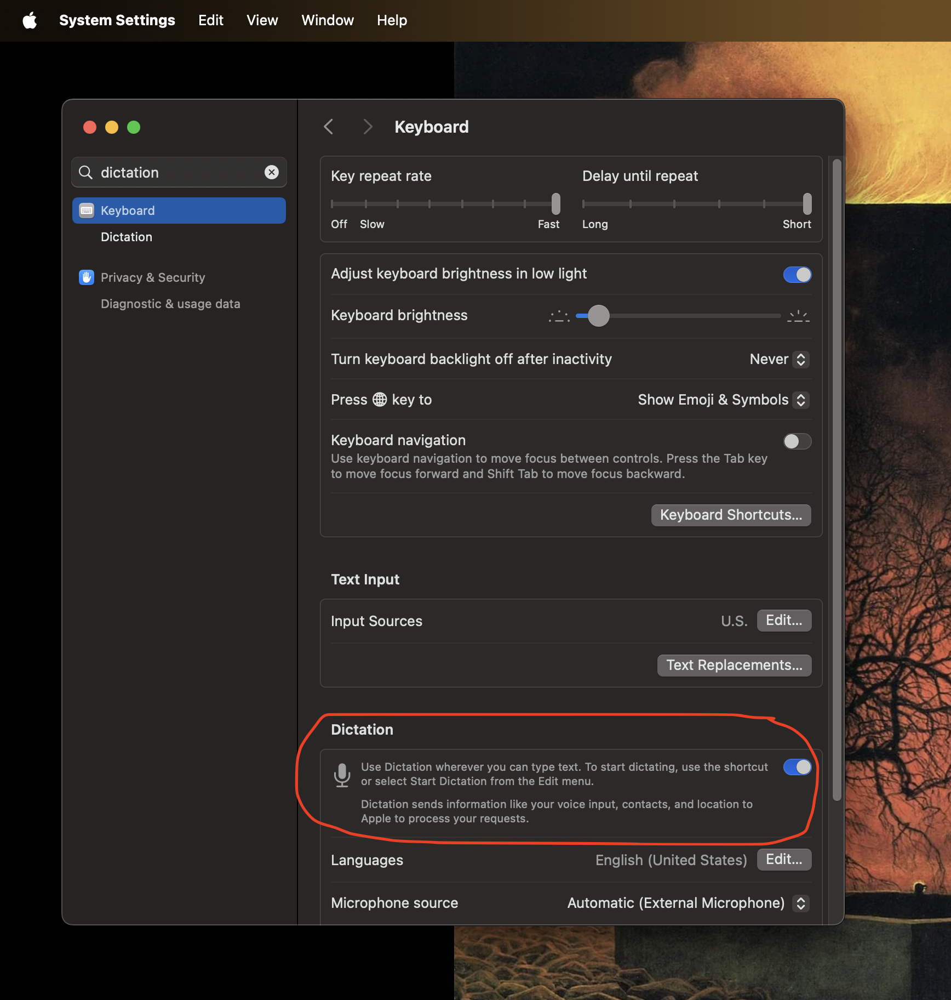
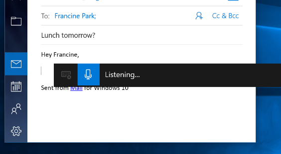

# You Can Probably Write Emails Twice as Fast using Dictation and LLMs

The core point of this short article is that voice dictations and Large Language Models (LLMs) are an excellent combination. Here we will be focusing on emails as an example, but great combination holds true across many other tasks.

##

Until recently I never used LLMs to help me with emails. A few times I tried. Consistently I found that by the time I finished typing out what should be in the email, I basically had a finished email already, so the LLM wasn't needed.

If you had to break the task of writing an email up, the big time consuming part is getting what you want to say onto paper, in AI terms "providing context" and the easy part is formatting it. The LLM can only help with the formatting, so it's not that useful. 

But, it turns out that dictation is a very efficient way to get what you want to say into paper. Studies show, for instance that dictation is around 3x as fast as typing for the same number of words [3]. When I have used dictation in the past I found it quite unnatural. I spent a lot of time pausing to think about how to exactly phrase the next sentence, and a lot of mental energy avoiding verbal tics like um and ahh. But if you know your dictation is going straight into a LLM, you don't need to worry about this, you can plan as you speak, just as if you were talking to a human scribe.

Dictation is a very efficient way to provide context, but the output is an unstructured stream-of-consciusness. LLMS need lots of context to succeed, and they are great at formatting. It's a very effective combination.

## The Workflow

Voice Input -> Speech Recognition -> AI Processing -> Email Client. Talk naturally, let AI clean it up, send your email.

I did a little personal benchmarking on this, typing and dictating a few 100-word emails. The outcomes indicate that this method cuts email writing time in half. My typing speed is considered pretty fast too, around 80-90 words per minute, so this might represent a 3x or even 4x speedup for slower typists.

Most professionals send about 40 emails per week, taking 5 minutes each [1][2]. That's over 3 hours of typing, so trying this out could save you 1.5 hours weekly.

## How to Do It

I have created a 3-minute walkthrough [here](https://www.youtube.com/watch?v=Zt98FBxtmAQ&ab_channel=anyone-can-build)

But here are the instructions in text:

1. Enable dictation on your computer

    **Macbook**
    
    1. on a macbook: settings --> search dictation --> keyboard --> toggle dictation on
    2. now when you press "control" twice on any text field it will put your speech into that field instead
    
    
    
    **Windows**
    
    1. Press Windows key + H to open voice typing
    2. Click the microphone button or press Alt + ` (backtick) to start dictating
    3. Your speech will be converted to text in any text field
    
    

2. Talk through what you want to say – don't worry about perfect wording or mistakes. End with: "dash dash dash dash turn this into a professional email"
4. Paste your words into Claude or ChatGPT or your preferred model
5. Review what the AI wrote
6. Copy it to your email, make any final tweaks
7. Send

A 100-word email takes about 3 minutes this way, compared to 6 minutes of typing. Plus, speaking your thoughts out loud is more fun than typing and often helps you frame ideas more effectively.

## Things to Consider

The main issue: you'll be talking out loud, which can disturb others in an open office, so maybe keep this for work from home days.

Also, it's most useful for emails longer than 50-75 words. Anything shorter than this seems to be faster to just type directly.

## Give It a Try

Next time you need to write a longer email, try this method. Setup takes 3 minutes, and if it works this could make your work day noticeably more enjoyable.

---

## References

[1] Karat, C.M., Halverson, C., Horn, D., Karat, J. (1999). "Patterns of entry and correction in large vocabulary continuous speech recognition systems". Proceedings of the SIGCHI conference on Human Factors in Computing Systems (CHI '99). New York, NY, US: ACM. pp. 568–575. doi:10.1145/302979.303160

[2] Slack. "How to save employees time". Slack Blog. https://slack.com/intl/en-au/blog/productivity/save-employees-time

[3] Ruan, S., Wobbrock, J.O., Liou, K., Ng, A., Landay, J. (2016). "Speech Is 3x Faster than Typing for English and Mandarin Text Entry on Mobile Devices". arXiv preprint. doi:10.1145/302979.303160

[4] Medimorec, S., Risko, E.F. (2023). "Comparing the cognitive demands of writing by hand versus typing". Frontiers in Psychology, 14. https://www.frontiersin.org/journals/psychology/articles/10.3389/fpsyg.2023.1108898/full