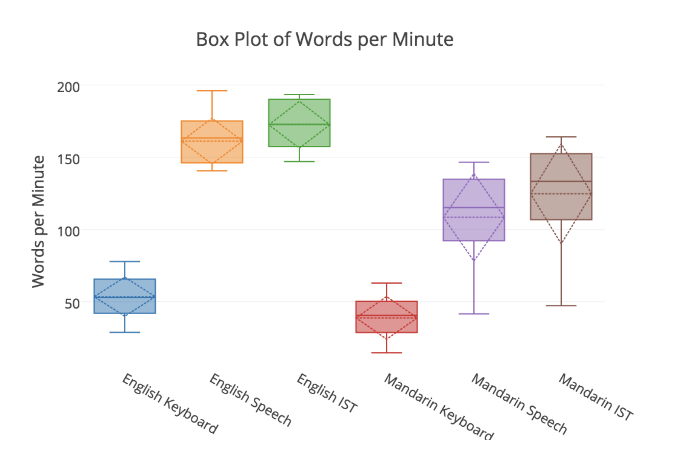
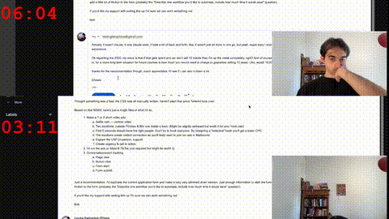

# How I Write Emails Now

## The Thing That Actually Works

So I've been using dictation with LLMs to write emails and it's legitimately twice as fast as typing. Maybe sounds like hype but I timed it.

## How It Works

You enable dictation on your computer (ask your LLM how) then just talk through what you want your email to say. Not carefully dictating - just explaining, stream of consciousness, keep in the ums and ahh's and backtracking, then at the end say "dash dash dash dash, make this into a professional email for my boss" or whatever.

Then you take that transcript, paste it into Claude or ChatGPT (or on a mac you can dictate directly into the LLM chat interface), and it gives you something you can actually send. For a 100 word email the whole process takes about 3 minutes, or half the time of typing it out character by character. That's for me at least, and my WPM is a reasonable 80-90.

Also more importantly it's a lot more fun to speak your ideas out loud. It feels like you're some kind of aristocrat with a scribe sitting there taking notes.

## There's Actually Research on This

Stanford did a study in 2016 ([Ruan et al.](https://doi.org/10.1145/302979.303160)) where they found dictation is 3x faster than typing on mobile devices. But that was traditional dictation where you speak every word exactly as it should appear.

This is different - you're not dictating the final text, you're just explaining what you want to say. The LLM handles turning your rambling into actual sentences. So it's probably much faster than what they measured, though that's yet to be proven.

There's also some research to say that typing is around as cognitively demanding as dictation, and again, this is probably a lot **less** cognitively demanding than dictation since you can make as many mistakes as you like. 

## Setting It Up Takes 5 Minutes

### On Mac

Go to Settings, search for "Dictation", turn it on. That's the entire setup.

Now when you press "control" twice while in any text input, it will put your dictation in there instead. It only seems to make mistakes when there is some nonstandard term involved. 

### On Windows

Settings → Time & Language → Speech → Turn on online speech recognition. Then Win+H starts dictation. Same process after that.

## Why Everyone Isn't Doing This Yet

I actually don't know.

What I DO know though is that I spent a whole weekend overengineering this. Built an entire [MCP server for Gmail integration](https://github.com/yourusername/mcp-gmail) so I could tell claude "send the email" and it would do that too. You know what? Total waste.

Copy-paste is fine. Actually, it's better - you'll want to tweak the output anyway.

What matters is this: **You'll write emails 2x faster and actually enjoy it.**

## Just Try It Once

Next email you need to write, try this instead of typing. Takes 3 minutes to set up and could save you half your email writing time.

---

Citations: [Speech Is 3x Faster than Typing for English and Mandarin Text Entry on Mobile Devices](https://doi.org/10.1145/302979.303160) - Ruan et al., Stanford University